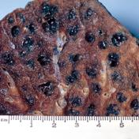
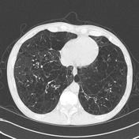
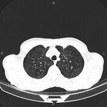
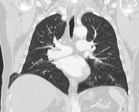
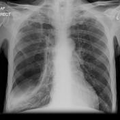
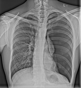
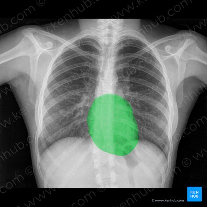

# My Bachelor Thesis  

[Dataset](https://nihcc.app.box.com/v/ChestXray-NIHCC)  

## List of diseases

1) Atelectasis  
2) Cardiomegaly  
3) Consolidation  
4) Edema  
5) Effusion  
6) Emphysema  
7) Fibrosis  
8) Hernia  
9) Infiltration  
10) Mass  
11) Nodule  
12) Pleural_Thickening  
13) Pneumonia  
14) Pneumothorax  
15) No Finding  

## Definitions

[Atelectasis](https://www.mayoclinic.org/diseases-conditions/atelectasis/symptoms-causes/syc-20369684) : partial collapse or incomplete inflation of the lung also known as a lobe. It happens when alveoli lose air.  

  
Atelectasis is usually seen on chest x-rays as small volume linear shadows, usually peripherally or at the lung bases. The underlying cause (such as a lung tumour or pleural effusion) may also be visible.  

[Sources](https://radiopaedia.org/articles/atelectasis-summary#:~:text=Atelectasis%20is%20usually%20seen%20on,effusion%20may%20also%20be%20visible)  

[Cardiomegaly](https://www.medparkhospital.com/en-US/disease-and-treatment/what-is-cardiomegaly) : cardiomegaly, or an enlarged heart is when your heart is abnormally thick or overly streched, becoming lager than usual, with diffculty pumping blood.  

  
A chest X-ray with an enlarged cardiac silhouette and a cardiothoracic ratio of more than 50% suggests cardiomegaly.  
[Sources](https://radiopaedia.org/articles/cardiomegaly)  

[Pulmonary Consolidation](https://en.wikipedia.org/wiki/Pulmonary_consolidation) :  
a pulmonary consolidation is a region of normally compressible lung tissue that has filled with liquid instead of air.  

  
General features of consolidation on CXR include:

- airspace opacification causing obscuration of pulmonary vessels
- air bronchograms
Specific lobar consolidation can be determined by the location of airspace opacification, pattern and the effect on adjacent structures (silhouette sign):
- right upper lobe consolidation
  - may obscure right paratracheal stripe
  - may outline the horizontal fissure below
- right middle lobe consolidation
  - may obscure the right heart border
  - may outline the horizontal fissure above
- right lower lobe consolidation
  - may obscure the right hemidiaphragm
- left upper lobe consolidation
  - may obscure the left heart borde
  - may obscure the left paratracheal stripe
- left lower lobe consolidation
  - may obscure the left hemidiaphragm
  - may obscure the descending aorta  

[Sources](https://radiopaedia.org/articles/lobar-consolidation)  

[Pulmonary Edema](https://www.mayoclinic.org/diseases-conditions/pulmonary-edema/symptoms-causes/syc-20377009) :  
it is a condition caused by too much fluid in the lungs. This fluid collects in the many alveoli in the lungs, making it difficult to breathe.  

  
The chest radiograph remains the most practical and useful method of radiologically assessing and quantifying pulmonary oedema 3,4.

Features useful for broadly assessing pulmonary oedema on a plain chest radiograph include:

- upper lobe pulmonary venous diversion (stag's antler sign)
- increased cardiothoracic ratio/cardiac silhouette size: useful for assessing for an underlying cardiogenic cause or association
- features of pulmonary interstitial oedema:
  - peribronchial cuffing and perihilar haze
  - septal (Kerley) lines
  - thickening of interlobar fissures
- features of pulmonary alveolar oedema:
  - air space opacification classically in a batwing distribution  
  - may have air bronchograms
- pleural effusions and fluid in interlobar fissures (including 'vanishing' pulmonary pseudotumour)  

[Sources](https://radiopaedia.org/articles/pulmonary-oedema)  

[Pleural Effusion](https://my.clevelandclinic.org/health/diseases/17373-pleural-effusion) :  
pleural effusion is a collection of fluid around your lungs. It is the buildup of excess fluid between the layers of the pleura outside your lungs. (The pleura are thin membranes that line your lungs and the inside of your chest cavity.)  

  
Chest radiographs are the most commonly used examination to assess for the presence of pleural effusion; however, it should be noted that on a routine erect chest x-ray as much as 250-600 mL of fluid is required before it becomes evident 6. A lateral decubitus projection is most sensitive, able to identify even a small amount of fluid. At the other extreme, supine projections can mask large quantities of fluid.  

### Chest radiograph (lateral decubitus)

A lateral decubitus film (obtained with the patient lying on their side, effusion side down, with a cross table shoot through technique) can visualise small amounts of fluid layering against the dependant parietal pleura.

### Chest radiograph (erect)

Both PA and AP erect films are insensitive to small amounts of fluid. Features include:

- blunting of the costophrenic angle
- blunting of the cardiophrenic angle
- fluid within the horizontal or oblique fissures
- eventually, a meniscus will be seen, on frontal films seen laterally and gently sloping medially (note: if a hydropneumothorax is present, no such meniscus will be visible)
- with large volume effusions, mediastinal shift occurs away from the effusion (note: if coexistent collapse dominates then mediastinal shift may occur towards the effusion)
Lateral films are able to identify a smaller amount of fluid as the costophrenic angles are deepest posteriorly.

A subpulmonic effusion (a.k.a. infrapulmonary effusion) may be seen when there is previously established pulmonary disease, but can also be encountered in normal lungs. It can be difficult to identify on frontal radiographs. They are more common on the right, and usually unilateral. The following features are helpful 6:

- right: peak of the hemidiaphragm is shifted laterally
- left: increased distance between lower lobe air and gastric bubble
A lateral decubitus film is again ideal.

### Chest radiograph (supine)

Large amounts of fluid can be present on supine films with minimal imaging changes, as the fluid is dependant and collects posteriorly. There is no meniscus, and only a veil-like increased density of the hemithorax may be visible. It is therefore especially difficult to identify similar sized bilateral effusions as the density of the lungs will be similar.  

[Sources](https://radiopaedia.org/articles/pleural-effusion)  

[Emphysema](https://www.mayoclinic.org/diseases-conditions/emphysema/symptoms-causes/syc-20355555) :  
the alveoli in the lungs are damaged, over time, the inner walls of the alveoli weaken and rupture - creating larger air spaces instead of many small ones. This reduces the surface area of the lungs and, in turn, the amount of oxygen that reaches your bloodstream.  

  
Except in the case of very advanced disease with bulla formation, chest radiography does not image emphysema directly, but rather infers the diagnosis due to associated features.

- hyperinflation
  - flattened hemidiaphragm(s): the most reliable sign
  - increased and usually irregular radiolucency of the lungs
  - increased retrosternal airspace
  - increased anteroposterior diameter of the chest
  - widely spaced ribs
  - sternal bowing
  - tenting of the diaphragm
  - sabre-sheath trachea
  - blunting of the lateral and posterior costophrenic angles  
- vascular changes
  - a paucity of blood vessels which are often distorted
  - pulmonary arterial hypertension
    - pruning of peripheral vessels
    - an increased calibre of central arteries
    - right ventricular enlargement  

It should be remembered, however, that the most common plain film appearance of COPD is "normal" and the role of chest radiography is to eliminate other causes of lung symptoms such as infection, bronchiectasis or cancer 6.  

[Sources](https://radiopaedia.org/articles/pulmonary-emphysema?lang=gb)  

[Pulmonary Fibrosis](https://www.healthdirect.gov.au/pulmonary-fibrosis#:~:text=Pulmonary%20fibrosis%20is%20a%20lung%20disease.,enough%20oxygen%20enters%20your%20blood.) :  
the tissue around the air sacs of the lungs - known as alveoli - becomes damaged, thickened and scarred. As the lungs scar and stiffen, breathing becomes more difficult. It can mean that not enough oxygen enters your blood.  

  

### CT

Many features can imply underlying pulmonary fibrosis,  these include:

- honeycombing
- traction bronchiectasis
- lung architectural distortion
- reticulation
- interlobular septal thickening: this feature is not specific for fibrosis  

[Sources](https://radiopaedia.org/articles/pulmonary-fibrosis)  

[Lung Hernia](https://en.wikipedia.org/wiki/Lung_hernia) :  
it is a protrusion (something that bulges out or is protuberant or projects from its surroundings) of lung outside of thoracic wall.  

  
  

[Sources](https://radiopaedia.org/articles/lung-hernia-1?lang=gb)  

[Pulmonary Infiltration](https://en.wikipedia.org/wiki/Pulmonary_infiltrate#:~:text=A%20pulmonary%20infiltrate%20is%20a,observed%20on%20a%20chest%20radiograph.) :  
it is a substance denser than air, such as pus, blood, or protein, which lingers within the parenchyma of the lungs.  
  
An infiltrate on a chest X-ray usually appears whiter than the surrounding lung and is not well defined.  
[Sources](https://www.researchgate.net/figure/Chest-x-ray-shows-bilateral-peripheral-pulmonary-infiltrates-with-no-evidence-of-pleural_fig1_242017722)

[Mass](https://radiopaedia.org/articles/pulmonary-mass) :  
a pulmonary mass is any area of pulmonary opacification that measures more than 30 mm.  
  

[Sources](https://radiopaedia.org/articles/pulmonary-mass)  

[Lung Nodule](https://my.clevelandclinic.org/health/diseases/14799-pulmonary-nodules) :  
an abnormal growth that forms in a lung. You may have many nodules in one or both lung, most of them are benign.  

  
They are generally homogeneous (without air bronchograms or alveolograms) and are well-defined since their margins are sharp and they are surrounded by normally aerated lung parenchyma. They are quite separate from airspace nodules that often have an irregular margin and are usually ~8 mm in diameter. (For further discussion, see the article on nodular opacification.)  

[Sources](https://radiopaedia.org/articles/pulmonary-nodule-1?lang=gb)

[Pleural Thickening](https://www.mesothelioma.com/asbestos-cancer/pleural-thickening/) :  
it is when scar tissue expands the thin lining around the lungs (the pleura). It can be triggered by infection, injury or exposure to asbestos.  

  
Here, (differential diagnosis), the arms are mimicking pleural thickening in an x-ray image.  

  
Pleural thickening is usually first spotted through a chest X-ray. In fact, it is commonly found in routine chest X-rays along the edges of the lung. This is because the X-ray beam passes through the edges tangentially (not straight through) so it is easier to visualize.  

[Sources](https://radiopaedia.org/articles/pleural-thickening)  
[Sources](https://www.asbestos.com/mesothelioma/pleural-thickening/)  

[Pneumonia](https://en.wikipedia.org/wiki/Pneumonia) :  
it is an inflammatory condition of the lung, primarily affecting the small air sacs (alveoli).  

  
There are subtle white spots on chest x-rays to detect pneumonia.  

[Sources](https://radiopaedia.org/articles/pneumonia)  
[Sources](https://www.ncbi.nlm.nih.gov/pmc/articles/PMC8423280/#:~:text=The%20white%20spots%20in%20the,variability%20%5B2%2C%203%5D.)  

[Pneumothorax](https://www.cancer.gov/publications/dictionaries/cancer-terms/def/pneumothorax#) :  
an abnormal collection of air in the space between the thin layer of tissue that covers the lungs and the chest cavity. This can cause all or part of the lung to collapse.  

  
A pneumothorax is, when looked for, usually easily appreciated on erect chest radiographs. Typically they demonstrate:

- visible visceral pleural edge is seen as a very thin, sharp white line
- no lung markings are seen peripheral to this line
- peripheral space is radiolucent compared to the adjacent lung
- lung may completely collapse
- mediastinum should not shift away from the pneumothorax unless a tension pneumothorax is present (discussed separately)
- subcutaneous emphysema and pneumomediastinum may also be present
Described methods for estimating the percentage volume of pneumothorax from an erect PA radiograph include:

- Collins method 19
  - % = 4.2 + 4.7 (A + B + C)
  - A is the maximum apical interpleural distance
  - B is the interpleural distance at midpoint of upper half of lung
  - C is the interpleural distance at midpoint of lower half of lung
- Rhea method 20
- Light index 21
  - % of pneumothorax = 100−(DL3/DH3×100)
  - DL is the diameter of the collapsed lung
  - DH is the diameter of the hemithorax on the collapsed side
In cases where a pneumothorax is not clearly present on standard frontal chest radiography a number of techniques can be employed:

- lateral decubitus radiograph:
  - should be done with the suspected side up- the lung will then 'fall' away from the chest wall
- expiratory chest radiograph:
  - lung becomes smaller and denser
  - pneumothorax remains the same size and is thus more conspicuous: although some authors suggest that there is no difference in detection rate 6
- CT scan
When imaged supine detection can be difficult: see pneumothorax in a supine patient, and pneumothorax is one cause of a transradiant hemithorax.  

[Sources](https://radiopaedia.org/articles/pneumothorax)

Healthy lungs :  

### Heart & Diaphragm  

  

### Lungs & Mediastinum

  

### Trachea

  

[Sources](https://www.kenhub.com/en/library/anatomy/normal-chest-x-ray)  

#### Python venv installation  

##### Windows

###### Creation (Windows)

python -m venv env  

###### Activation (Windows)

env\Scripts\activate.bat  
env\Scripts\activate  
./env/Scripts/activate

###### Deactivation (Windows)

deactivate  

##### MacOS/Linux  

###### Creation (MacOs/Linux)

python3 -m venv env  

###### Activation (MacOs/Linux)

source env/bin/activate  

###### Deactivation (MacOs/Linux)

deactivate  

#### Python requirements file commands

Works with python 3.10.10
pip list  
pip install -r requirements.txt  
pip freeze > requirements.txt  

##### Install python 3.10 on MacOs and run the app in a python 3.10 env

brew install python@3.10  
python3.10 -m venv env  
source env/bin/activate  
pip3.10 install -r requirements.txt  
cd myApp  
python3.10 main.py  
deactivate  
